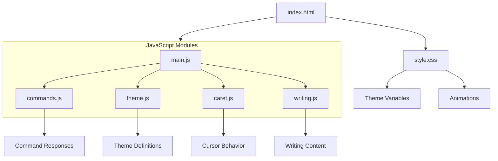
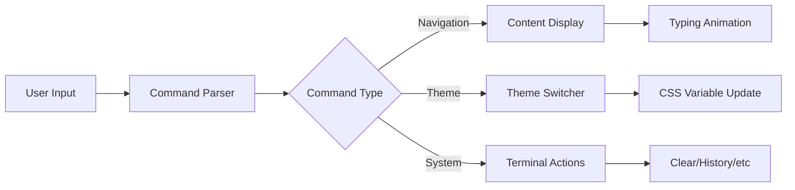
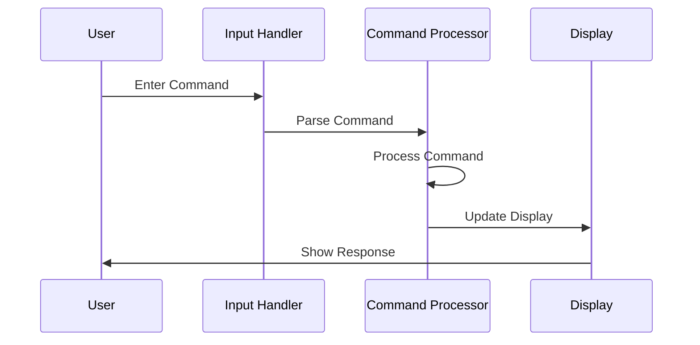
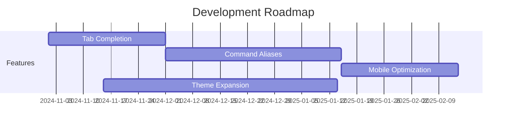

# Terminal-Style Personal Website 🖥️

A minimalist, interactive terminal-themed personal portfolio built with vanilla JavaScript. Navigate through my professional journey using familiar command-line inputs.

## ✨ Concept Preview
```
guest@lundeenterminal:~$ help

about          a little about me
resume         view my resume
projects       ongoing and past projects
contact        reach out!
bookshelf      some favorite bits of literature and movies
help           (you're here)
clear          clear terminal
```

## 🎨 Available Themes

| Theme Name | Description | Primary Colors |
|------------|-------------|----------------|
| Modern Ink | Clean monochrome | Black on white, red accents |
| Retro | Classic terminal | Neon green on black |
| Rose Pine Moon | Elegant purple | Purple and pink pastels |
| Blue Dolphin | Ocean-inspired | Deep blue with cyan |

## 🏗️ Architecture



## 🔍 Core Features



## 🚀 Command Flow



## 🛠️ Quick Start

1. Clone the repository:
```bash
git clone https://github.com/yourusername/terminal-website.git
```

2. Open `index.html` in your browser
3. Start typing commands!

## 📈 Performance Considerations

| Feature | Implementation | Impact |
|---------|---------------|---------|
| Typing Animation | CSS Transitions | Smooth visuals |
| Theme Switching | CSS Variables | Instant updates |
| Command History | Array Buffer | Memory efficient |
| Content Loading | Dynamic Import | Fast initial load |

## 🎯 Future Roadmap



## 🙏 Credits

- Background art by [EiskalterEngel18](https://www.artstation.com/artwork/DAw5xn)
- Terminal concept inspired by [Linda Tong](https://github.com/lindaktong)

## 📄 License

MIT License - feel free to use and modify for your own portfolio!
